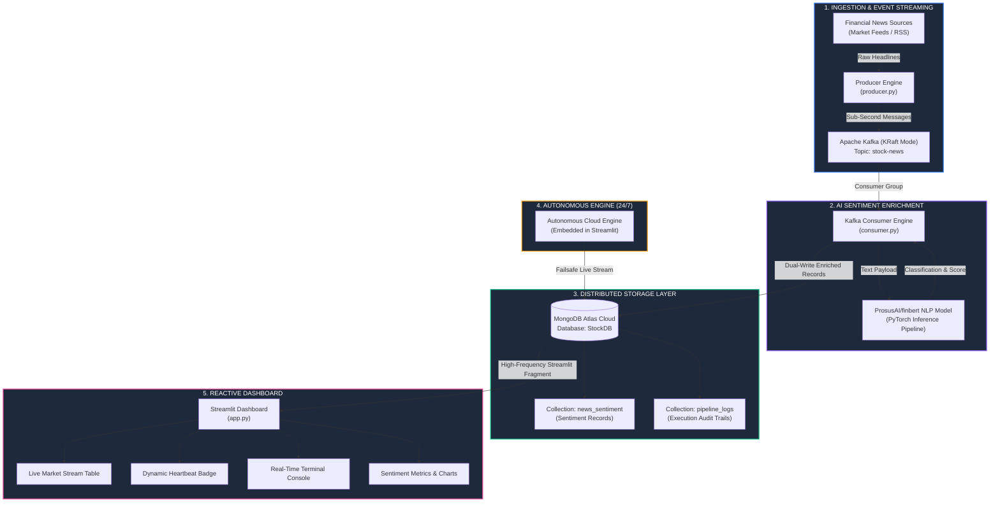

# 📈 Real-Time Stock News Sentiment Pipeline

> **Enterprise-Grade Data Engineering & NLP Streaming System**  
> Apache Kafka · FinBERT · MongoDB Atlas · Streamlit Community Cloud · 24/7 Global Intelligence

[](https://realtime-stock-sentiment-pipeline.streamlit.app/)
[](https://www.python.org/)
[](LICENSE)
[](https://kafka.apache.org/)
[](https://huggingface.co/ProsusAI/finbert)
[](https://www.mongodb.com/atlas)

🌐 **Live Application**: [https://realtime-stock-sentiment-pipeline.streamlit.app/](https://realtime-stock-sentiment-pipeline.streamlit.app/)

---

## 📌 Table of Contents

- [Overview](#-overview)
- [System Architecture & Data Flow](#-system-architecture--data-flow)
- [Key Features](#-key-features)
- [Real-World Use Cases](#-real-world-use-cases)
- [Repository & Folder Structure](#-repository--folder-structure)
- [Cloning & Quickstart Guide](#-cloning--quickstart-guide)
- [Production Cloud Deployment (24/7)](#-production-cloud-deployment-247)
- [Configuration Reference](#-configuration-reference)
- [Verification & Automated Testing](#-verification--automated-testing)
- [Creator & Contact](#-creator--contact)
- [License](#-license)

---

## 🧠 Overview

The **Real-Time Stock News Sentiment Pipeline** is a distributed streaming intelligence platform engineered to ingest high-frequency financial headlines, perform deep contextual sentiment classification via **FinBERT** (`ProsusAI/finbert`), persist real-time enriched data and audit telemetry into **MongoDB Atlas**, and deliver live market analytics through a reactive **Streamlit** dashboard.

Designed for high availability, the system operates in a dual-mode hybrid architecture: local Kafka streaming workers provide sub-second FinBERT batch inference, while an embedded autonomous cloud engine guarantees 24/7 continuous data freshness and active heartbeats on **Streamlit Community Cloud** even when local machines are offline.

---

## 🏛️ System Architecture & Data Flow



### End-to-End Pipeline Stages
1. **Event Ingestion**: Financial market headlines for bellwether tickers (AAPL, TSLA, NVDA, MSFT, AMZN, GOOGL, META, AMD, JPM, BAC) are published to the Kafka topic `stock-news`.
2. **Distributed Streaming**: Apache Kafka operates in modern **KRaft mode** (no ZooKeeper dependency), managing event partitions with guaranteed ordering.
3. **Deep Financial NLP**: The consumer processes text payloads through **FinBERT**, classifying tone (`POSITIVE`, `NEGATIVE`, `NEUTRAL`) and extracting granular confidence scores.
4. **Cloud Persistence**: Enriched records and execution logs are committed to **MongoDB Atlas** with ISO UTC timestamps.
5. **Autonomous Cloud Engine**: An embedded self-healing engine ensures continuous streaming on Streamlit Cloud regardless of local worker states.
6. **Reactive Dashboard**: Streamlit `@st.fragment` isolated updates refresh tables, metrics, and terminal logs without full-page reloads or screen dimming.

---

## ✨ Key Features

| Capability | Technical Details | Advantage |
|---|---|---|
| **Real-Time Streaming** | Apache Kafka KRaft cluster | Sub-second event propagation without ZooKeeper overhead |
| **Financial AI Model** | `ProsusAI/finbert` (Hugging Face) | Specialized financial vocabulary; far superior to generic sentiment models |
| **Zero External API Costs** | Local PyTorch inference & VADER engine | 100% free; zero dependence on paid third-party APIs |
| **Dual-Mode Operation** | Hybrid local Kafka workers + Cloud Engine | Heavy FinBERT inference locally; 24/7 autonomous streaming on Cloud |
| **Dynamic Stream Heartbeat** | Active pulse detection with age tracking | Live visual badge: `STREAM: LIVE FAST` (pulsing green) or `STREAM: IDLE` |
| **Audit Log Terminal** | In-app terminal viewer with filtering | Inspect live execution telemetry, filter by severity level, and export logs |
| **Anti-Dimming UI** | Custom Streamlit CSS & fragment execution | Zero screen dimming or tab jumping during high-frequency updates |
| **Enterprise Security** | Fully externalized environment variables | Zero credential exposure; clean git tracking |

---

## 🎯 Real-World Use Cases

- **Quantitative Algorithmic Trading**: Feed real-time sentiment signals into automated execution models to capitalize on market-moving headlines.
- **Portfolio Risk & Anomaly Management**: Flag sharp spikes in negative sentiment across portfolio holdings for immediate risk mitigation.
- **Financial Intelligence & Equity Research**: Deliver aggregated, real-time sentiment telemetry to research desks and portfolio managers.
- **Compliance & Regulatory Audit**: Retain an immutable, timestamped historical ledger of news events and classification telemetry.

---

## 📁 Repository & Folder Structure

```
realtime-stock-sentiment-pipeline/
│
├── .streamlit/
│   ├── config.toml              # UI styling, anti-dimming CSS, server parameters
│   └── secrets.toml.example     # Template for configuring cloud MongoDB credentials
│
├── docker-compose.yml           # Multi-container orchestration for Kafka (KRaft) & MongoDB
├── requirements.txt             # Lean dependencies for Streamlit Community Cloud
├── requirements-pipeline.txt    # Full pipeline dependencies (PyTorch, Transformers, Kafka)
│
├── app.py                       # Reactive Streamlit dashboard with autonomous cloud engine
├── producer.py                  # High-throughput CLI producer streaming to Kafka
├── consumer.py                  # CLI Kafka consumer with local FinBERT inference & dual-write
├── run_pipeline.py              # Unified process supervisor managing producer & consumer
├── sync_to_atlas.py             # Data synchronization utility (Local MongoDB → Atlas)
├── backfill_logs.py             # Audit log initialization & backfill utility
│
├── start_pipeline.bat           # 1-Click Windows execution script
├── start_pipeline.ps1           # Windows PowerShell automated launcher
├── test_dashboard.py            # Comprehensive unit test suite (14 test cases)
├── LICENSE                      # MIT Open-Source License
└── README.md                    # Project documentation & architectural manual
```

---

## 🚀 Cloning & Quickstart Guide

### Prerequisites
- **Python 3.10+**
- **Docker Desktop** (Engine and Compose v2 enabled)
- **Git**

### Step 1: Clone the Repository
```bash
git clone https://github.com/unknown404-practice/realtime-stock-sentiment-pipeline.git
cd realtime-stock-sentiment-pipeline
```

### Step 2: Set Up Virtual Environment
```bash
# On Windows (PowerShell)
py -3.10 -m venv .venv
.\.venv\Scripts\activate

# On macOS / Linux
python3 -m venv .venv
source .venv/bin/activate
```

### Step 3: Install Dependencies
```bash
pip install --upgrade pip

# For full streaming pipeline (Kafka + FinBERT):
pip install -r requirements-pipeline.txt

# Or for lightweight dashboard only:
pip install -r requirements.txt
```

### Step 4: Start Infrastructure Containers
Start Apache Kafka (KRaft) and MongoDB services:
```bash
docker compose up -d
docker compose ps
```

### Step 5: Start Streaming Workers
Launch the unified supervisor to run both the producer and FinBERT consumer in parallel:
```bash
python run_pipeline.py --interval 0.8
```
*(Press `Ctrl+C` at any time to gracefully terminate both workers.)*

### Step 6: Launch the Dashboard
In a separate terminal window, activate your virtual environment and start the application:
```bash
streamlit run app.py
```

---

## ☁️ Production Cloud Deployment (24/7)

This pipeline is engineered to deploy permanently to **Streamlit Community Cloud** backed by **MongoDB Atlas**.

### 1. MongoDB Atlas Setup (Free M0 Cluster)
1. Register a free account at [MongoDB Atlas](https://www.mongodb.com/atlas).
2. Deploy a shared free M0 cluster.
3. In **Database Access**, create a user with read and write privileges.
4. In **Network Access**, add `0.0.0.0/0` to allow inbound connections from Streamlit Cloud.
5. Retrieve your cluster SRV connection string (**Database** → **Connect** → **Drivers**).

### 2. Streamlit Community Cloud Deployment
1. Push your code to GitHub.
2. Sign in to [share.streamlit.io](https://share.streamlit.io/) with your GitHub account.
3. Click **New App**, select your repository, set the branch to `main`, and specify `app.py` as the entry point.
4. Navigate to **Advanced Settings** → **Secrets**, and paste your secrets using the template below:

```toml
MONGO_URI = "mongodb+srv://<DB_USERNAME>:<DB_PASSWORD>@<YOUR_CLUSTER_HOST>/?appName=Cluster0"
DB_NAME = "StockDB"
COLLECTION_NAME = "news_sentiment"
LOGS_COLLECTION_NAME = "pipeline_logs"
```

5. Click **Deploy**. Your dashboard is now live globally with 24/7 autonomous streaming!

---

## 🔧 Configuration Reference

All credentials and environmental configurations are managed via Streamlit secrets or environment variables:

| Variable | Description | Example Placeholder |
|---|---|---|
| `MONGO_URI` | MongoDB connection URI | `mongodb+srv://<USERNAME>:<PASSWORD>@<CLUSTER>/...` |
| `DB_NAME` | Target database name | `StockDB` |
| `COLLECTION_NAME` | Enriched sentiment records collection | `news_sentiment` |
| `LOGS_COLLECTION_NAME` | System audit logs collection | `pipeline_logs` |

> 🔒 **Security Notice**: `.streamlit/secrets.toml` is strictly gitignored and never committed to source control. Never commit plaintext database connection strings.

---

## 🧪 Verification & Automated Testing

The project includes an automated test suite verifying database connection handlers, FinBERT classification fallbacks, stream heartbeats, and UI components:

```bash
python -m unittest test_dashboard.py -v
```

### Verified Test Cases
- ✅ **Database Connection Resolvers**: Failover logic across Atlas, local containers, and demo mode
- ✅ **Sentiment Classification Integrity**: Accurate sentiment label and confidence assignment
- ✅ **Dynamic Heartbeat Detection**: Sub-30s active stream detection and stale status flagging
- ✅ **Broker Reachability**: Fast-failing network broker checks preventing thread deadlocks
- ✅ **UI State Persistence**: Multi-cycle theme persistence, slider configurations, and log exports

---

## 👤 Creator & Contact

Developed by **Ranadeep Saha**  
*Member, Google Developer Group*

[](https://github.com/unknown404-practice)
[](https://www.linkedin.com/in/ranadeep-saha-a03296404/)
[](mailto:ranadeep2021saha@gmail.com)

| Channel | Link |
|---|---|
| 🐙 **GitHub** | [github.com/unknown404-practice](https://github.com/unknown404-practice) |
| 💼 **LinkedIn** | [linkedin.com/in/ranadeep-saha-a03296404](https://www.linkedin.com/in/ranadeep-saha-a03296404/) |
| 📧 **Email** | [ranadeep2021saha@gmail.com](mailto:ranadeep2021saha@gmail.com) |

---

## 📄 License

This project is licensed under the **MIT License** — see the [`LICENSE`](LICENSE) file for details.

---

<p align="center">
  Crafted with precision by <a href="https://github.com/unknown404-practice">Ranadeep Saha</a> · Member, Google Developer Group
</p>
